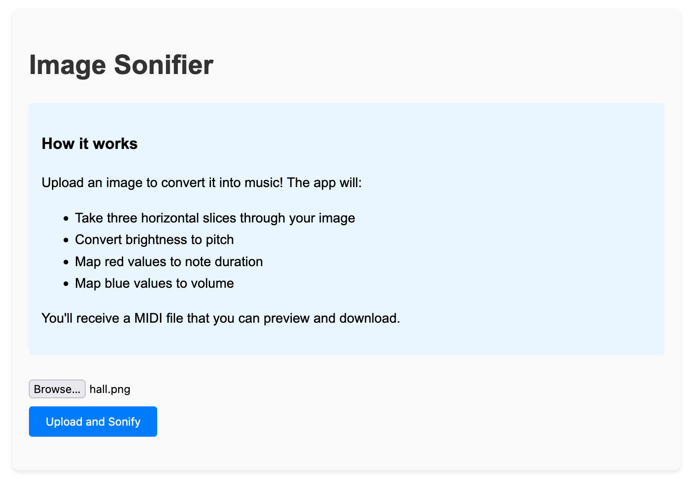

Trying to turn the particular jython music environment script for image sonifying (as used in 'Listening to Dura Europos', [Internet Archaeology](https://intarch.ac.uk/journal/issue56/8/) into a webpage app. 

(based on this code: https://github.com/shawngraham/image-sonification/tree/first)

```python
pip install flask pillow midiutil numpy
```

then
```python
python app.py
```



Example image


[Resulting sound midi file](sonified_hall.png.mid)
